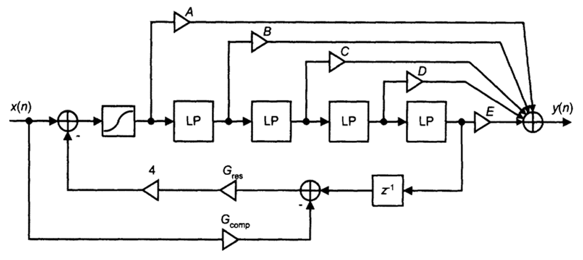

# MorphableFilter

A virtual analog filter that models the nonlinearities of the Moog ladder filter. The implementation is based on the following paper by Vesa Välimäki and Antti Huovilainen - https://direct.mit.edu/comj/article/30/2/19/94705/Oscillator-and-Filter-Algorithms-for-Virtual

The filter does not require any dependencies and should fit seamlessly into any C++ audio application.  An example JUCE application is provided to illustrate how to use it.

